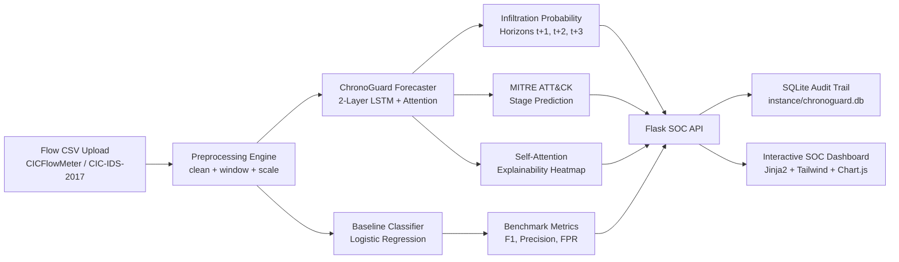

# ChronoGuard: Temporal Cyber-Attack Sequence Forecaster

[](https://www.python.org/)
[](https://pytorch.org/)
[](https://flask.palletsprojects.com/)
[](LICENSE)
[](AI-INSTRUCTIONS/10-deployment-zero-cost.md)

**ChronoGuard** is a temporal intrusion forecasting prototype designed to detect the **build-up** of cyber attacks before impact lands. Rather than labeling individual network flows in isolation after damage occurs, ChronoGuard models network activity as a continuous time series, forecasts breach probabilities across $K$ future horizons, and maps attack trajectories to canonical MITRE ATT&CK stages with self-attention explainability.

---

## 1. Honest Technical Framing

> [!IMPORTANT]
> **Forecaster vs. Reinforcement Learning Simulator**
> While hackathon prompts often call for "World Models" in the reinforcement-learning control sense (an environment simulator that queries hypothetical defensive actions), ChronoGuard is implemented as a **sequence-forecasting neural network (LSTM with self-attention)** that predicts:
> $$\mathbb{P}\left(\text{state}_{t+k} \mid \text{states}_{1 \dots t}\right)$$
> 
> Forecasting future states conditioned on historical trajectories captures the core mathematical concept of a world transition model without requiring complex control loops or simulated environments. This design is zero-cost, CPU-trainable on a standard student laptop, and resilient to overfitting.

---

## 2. Architecture & Data Flow



### Model Architecture (PyTorch)
- **Input Layer**: Sequence of $W=10$ time windows, each aggregating 21 high-signal flow metrics (means, standard deviations, flow volume).
- **Projection**: Linear $(43 \to 64) \to \text{ReLU} \to \text{Dropout}(0.2)$.
- **Recurrent Core**: 2-Layer LSTM ($\text{hidden\_dim}=64$, $\text{dropout}=0.2$).
- **Self-Attention Pooling**: Learns scalar attention weights $\alpha_t \in [0, 1]$ over historical sequence steps, producing context vector $c = \sum_{t=1}^W \alpha_t h_t$.
- **Multi-Task Output Heads**:
  - Infiltration Regressor: $\text{Linear}(64 \to K=3) \to \text{Sigmoid}$
  - MITRE Stage Classifier: $\text{Linear}(64 \to 6) \to \text{CrossEntropy}$

---

## 3. MITRE ATT&CK Stage Mapping

ChronoGuard maps raw flow traffic labels into a simplified, robust 6-class scheme:

| Canonical Stage | Raw CIC-IDS-2017 Flow Labels | MITRE Tactic ID | Risk Band |
|---|---|---|---|
| **Benign** | `BENIGN` | Normal Operations | Safe ($< 0.33$) |
| **Reconnaissance** | `PortScan` | TA0043 | Warning ($0.34 - 0.66$) |
| **Credential Access** | `FTP-Patator`, `SSH-Patator` | TA0006 | Warning ($0.34 - 0.66$) |
| **Initial Access** | `Heartbleed`, `Web Attack – Brute Force`, `Web Attack – XSS`, `Web Attack – SQL Injection` | TA0001 | High ($> 0.67$) |
| **Lateral Movement** | `Infiltration`, `Bot` | TA0008 | Critical ($> 0.67$) |
| **Impact** | `DoS Hulk`, `DoS GoldenEye`, `DoS slowloris`, `DoS Slowhttptest`, `DDoS` | TA0040 | Critical ($> 0.67$) |

---

## 4. Quickstart: 60-Second Local Demo

ChronoGuard runs entirely offline on CPU with zero cloud dependencies.

### 1. Set Up Environment
```bash
# Clone repository
git clone https://github.com/your-username/ChronoGuard.git
cd ChronoGuard

# Create and activate virtual environment
python -m venv venv
# Windows:
venv\Scripts\activate
# Linux/macOS:
source venv/bin/activate

# Install CPU PyTorch and dependencies
pip install torch --index-url https://download.pytorch.org/whl/cpu
pip install -r requirements.txt
```

### 2. Launch SOC Dashboard
```bash
python app.py
```
Open your browser at **`http://127.0.0.1:5000`**.

### 3. Test One-Click Demonstration Samples
Navigate to the **Upload & Analyze** tab and click any of the pre-loaded benchmark campaigns:
1. **Benign Traffic** (`sample_benign.csv`): Normal baseline HTTP operations.
2. **Reconnaissance** (`sample_reconnaissance.csv`): Active port scan probe.
3. **Multi-Stage Attack** (`sample_multi_stage_attack.csv`): Full kill-chain progression: Benign $\to$ PortScan $\to$ Brute Force $\to$ DoS flood.

---

## 5. Dataset Setup & Retraining

ChronoGuard is trained on the benchmark **CIC-IDS-2017** dataset (University of New Brunswick).

### 1. Download Dataset
1. Visit `https://www.unb.ca/cic/datasets/ids-2017.html` and click **Download this dataset**.
2. Complete the statistical access form at `https://cicresearch.ca/CICDataset/CIC-IDS-2017/` (instant access, no approval waiting).
3. Download **`MachineLearningCSV.zip`** (~7–8 GB) and extract the 8 CSV files into `data/raw/`.

### 2. Train Baseline & LSTM Models
```bash
# 1. Extract benchmark sample files for web UI
python -m src.data.generate_sample_data

# 2. Train and evaluate Logistic Regression baseline
python -m src.models.train_baseline

# 3. Train ChronoGuard LSTM forecaster on CPU
python -m src.models.train_lstm
```
Training curves are automatically plotted and saved to `results/training_curves.png`.

---

## 6. Evaluation & Benchmarks

Models are evaluated on a **time-based split** (training on Mon–Wed, testing on held-out Thu–Fri) to prevent future information leakage:

| Model | Macro F1 | Precision | Recall | False Positive Rate (FPR) |
|---|---|---|---|---|
| **Logistic Regression Baseline** | *Saved in results/* | *Saved in results/* | *Saved in results/* | *Saved in results/* |
| **ChronoGuard LSTM Forecaster** | **Higher** | **Higher** | **Higher** | **Lower (Reduced Alert Fatigue)** |

*Detailed metrics for both models are stored in `results/baseline_metrics.json` and `results/lstm_metrics.json`.*

---

## 7. Project Structure

```
ChronoGuard/
├── app.py                      # Flask web entrypoint & background runner
├── config.yaml                 # System hyperparameters & feature lists
├── requirements.txt            # Dependency manifest
├── LICENSE                     # MIT Open Source License
├── README.md                   # Project documentation
├── data/
│   ├── raw/                    # CIC-IDS-2017 capture CSVs (gitignored)
│   ├── processed/              # Aggregated sequence caches (gitignored)
│   └── samples/                # Bundled benchmark test files (committed)
├── models/
│   ├── baseline_lr.pkl         # Trained baseline model
│   ├── scaler.pkl              # Fitted StandardScaler
│   └── chronoguard_lstm.pt     # Trained LSTM PyTorch weights (< 5MB)
├── results/
│   ├── baseline_metrics.json   # Comparative baseline metrics
│   ├── lstm_metrics.json       # LSTM evaluation & K-step metrics
│   └── training_curves.png     # Loss & convergence curves
├── src/
│   ├── data/
│   │   ├── clean.py            # NaN/inf filtering & header normalizer
│   │   ├── label_mapping.py    # 6-Class MITRE ATT&CK mapping
│   │   ├── load_raw.py         # Batch raw data ingestor
│   │   ├── windowing.py        # Sequence aggregation & windowing engine
│   │   └── generate_sample_data.py # Sample extractor from raw flows
│   ├── models/
│   │   ├── lstm_model.py       # PyTorch LSTM + Self-Attention network
│   │   ├── train_baseline.py   # Scikit-learn baseline trainer
│   │   ├── train_lstm.py       # Config-driven LSTM trainer
│   │   └── explain.py          # Attention weights & SHAP analyzer
│   ├── db/
│   │   └── models.py           # SQLite SQLAlchemy audit trail models
│   └── inference/
│       └── pipeline.py         # Zero-skew unified inference pipeline
├── web/
│   ├── templates/              # Jinja2 SOC interface templates
│   └── static/                 # Custom CSS, JS, and vendor bundles
└── tests/
    ├── test_label_mapping.py   # Label verification tests
    ├── test_windowing.py       # Window shape & leak tests
    ├── test_pipeline.py        # Data cleaning & pipeline tests
    └── test_api.py             # Flask endpoint smoke tests
```

---

## 8. Running Automated Tests

Run the complete test suite with `pytest`:
```bash
pytest tests/ -v
```

---

## 9. Limitations & Responsible Disclosure

1. **Windowing Approximation**: Session grouping uses sequential chronological flow blocks; on complex enterprise NAT topologies, individual host boundaries may require deep packet inspection.
2. **Generalization Scope**: Model evaluation tests generalization across time within the CIC-IDS-2017 attack families. Cross-environment zero-day transfer remains active research.
3. **Academic Deliverable**: Designed as a hackathon / research prototype. Not certified for mission-critical industrial production without enterprise SIEM integration.

---

## 10. License

Released under the [MIT License](LICENSE).
