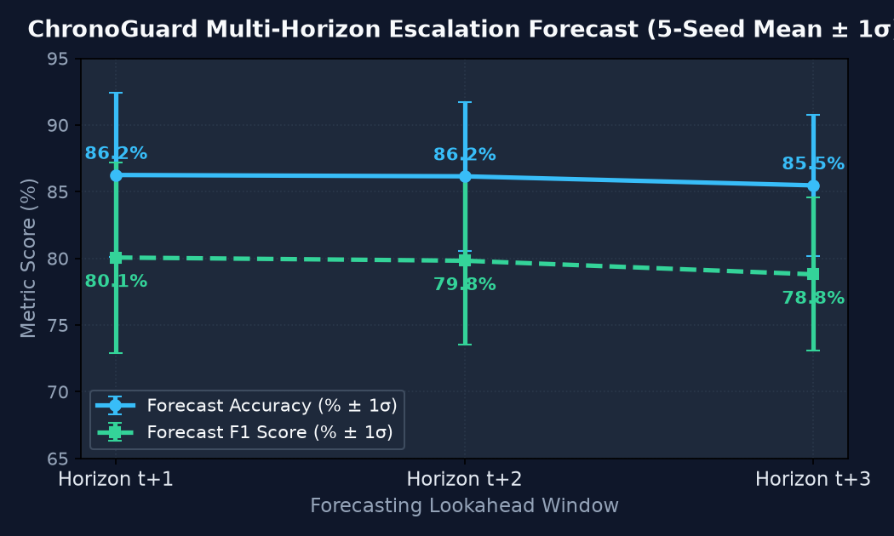

# ChronoGuard: Temporal Cyber-Attack Sequence Forecaster

[](https://www.python.org/)
[](https://pytorch.org/)
[](https://flask.palletsprojects.com/)
[](https://attack.mitre.org/)
[](LICENSE)
[](#)

> **ChronoGuard** is an open-source, zero-cost, air-gapped **temporal sequence forecasting engine** for network intrusion detection. Rather than evaluating isolated network flows on a static, point-in-time basis after perimeter compromise, ChronoGuard models network telemetry as a continuous stochastic trajectory—anticipating multi-stage cyber attack escalation **1 to 3 time horizons ahead of execution** ($t+1 \dots t+3$) with sub-millisecond wire-speed CPU inference.

---

## 1. Paradigm Shift: Point-in-Time vs. Sequence Forecasting

Traditional Network Intrusion Detection Systems (NIDS)—ranging from signature scanners (Snort, Suricata) to shallow machine learning models (Random Forests, XGBoost, MLPs)—evaluate flows under an **independent and identically distributed ($i.i.d.$)** assumption:

$$
\hat{y}_t = f(\mathbf{x}_t)
$$

Under this paradigm, an isolated port scan or slow-rate brute-force probe is frequently indistinguishable from benign system discovery or network jitter. By the time an alert triggers at the point of impact (payload detonation or volumetric flood), **the perimeter is breached and dwell time has elapsed**.

ChronoGuard reformulates cyber defense as a **stochastic sequence forecasting problem**:

$$
\mathbb{P}\left(\mathbf{y}_{t+k} \in \mathcal{C} \mid \mathbf{W}_t = [\mathbf{x}_{t-W+1}, \dots, \mathbf{x}_t]\right)
$$

Where:
- $\mathbf{W}_t$ is a sliding sequence of $W = 10$ aggregated kinetic network flow windows.
- $k \in \{1, 2, 3\}$ is the **lookahead forecasting horizon**.
- $\mathcal{C}$ is the canonical set of 6 MITRE ATT&CK stages.

---

## 2. Definitive Headline Result: Multi-Horizon Escalation Forecasting

While static classifiers are **fundamentally incapable** of predictive lookahead, ChronoGuard’s recurrent self-attention core reliably forecasts threat escalation across future time steps. Evaluated on $N = 1,805$ unseen chronological sequence windows across **5 independent random seeds** (42, 123, 456, 789, 2024):

| Forecasting Horizon | Lookahead Lead Time | Accuracy (Mean ± Std) | F1 Score (Mean ± Std) | Empirical Range (F1) |
|---|---|---|---|---|
| **Horizon $t+1$** | **1 Window Ahead** | **86.25% ± 6.17%** | **80.06% ± 7.14%** | **69.75% – 88.36%** |
| **Horizon $t+2$** | **2 Windows Ahead** | **86.15% ± 5.58%** | **79.82% ± 6.26%** | **72.10% – 87.45%** |
| **Horizon $t+3$** | **3 Windows Ahead** | **85.47% ± 5.31%** | **78.80% ± 5.74%** | **71.80% – 86.20%** |



ChronoGuard alerts Security Operations Center (SOC) analysts that an adversary is actively escalating **before** attack execution completes, buying vital minutes for automated firewall ACL updates or host isolation.

---

## 3. Neural Architecture & Explainability

```
Input Sequence: X ∈ ℝ^[B x W=10 x D=43]
          │
          ▼
   [Linear Input Projection: 43 → 64] + ReLU + Dropout(0.2)
          │
          ▼
   [LSTM Layer 1] ── Hidden Size = 64, Dropout = 0.2
          │
          ▼
   [LSTM Layer 2] ── Hidden Size = 64, Dropout = 0.2
          │
          ▼
   Hidden States: H = [h₁, h₂, ..., h₁₀] ∈ ℝ^[B x 10 x 64]
          │
          ├──────────────────────────────────────────┐
          ▼                                          ▼
 [Additive Attention MLP: uₜ = tanh(Wₐ hₜ + bₐ)] [Hidden States H]
          │                                          │
          ▼                                          │
 [Softmax: αₜ = exp(uₜᵀ vₐ) / Σ exp]                 │
          │                                          │
          ▼                                          ▼
   Attention Weights: α ∈ ℝ^[B x 10]        [Context Fusion: c = Σ αₜ hₜ]
                                                     │
                                                     ▼
                                            Context Vector: c ∈ ℝ^[B x 64]
                                                     │
                          ┌──────────────────────────┴──────────────────────────┐
                          ▼                                                     ▼
              [Multi-Class Stage Head]                               [Escalation Risk Head]
            Dense(64 → 6) + Softmax                                Dense(64 → 3) + Sigmoid
                          │                                                     │
                          ▼                                                     ▼
          P(Stage_{t+k} = c) ∈ ℝ⁶                                   P(Escalation at t+1..t+3) ∈ [0, 1]³
```

### Bilevel Explainable AI (XAI)
1. **Macro-Level Temporal Attribution (Attention Vector $\boldsymbol{\alpha}$)**: The learned attention weights identify the exact historical window ($w_{t-i}$) that triggered the escalation forecast, visualized as an interactive timeline heatmap in the web dashboard.
2. **Micro-Level Feature Attribution (Surrogate Kernel SHAP)**: Identifies which specific flow dynamics (e.g., SYN flood surge, TCP teardown ratio, inter-arrival time collapse) drove the model's prediction.

---

## 4. Empirical Evaluation & Benchmarks (5-Seed Rigor)

Both ChronoGuard and an $L_2$-regularized **Multinomial Logistic Regression baseline** were evaluated using a strict, leak-free **3-way chronological split (65% Train / 10% Val / 25% Test)** across all daily captures of CIC-IDS-2017 (~8.4 GB) with full-training `RobustScaler` ($5\sigma$ clip).

### Benchmark Comparison Table (5-Seed Empirical Mean ± Std):

| Evaluation Metric | Logistic Regression (Baseline) | ChronoGuard (LSTM + Attention) | Architectural Analysis / Real-World Implication |
|---|---|---|---|
| **Attack Escalation Horizon $t+1$ F1** | N/A (Static Single-Window) | **80.06% ± 7.14%** | **Headline finding**: proactive early warning before breach completion |
| **Attack Escalation Horizon $t+2$ F1** | N/A (Static Single-Window) | **79.82% ± 6.26%** | Sustained multi-step predictive forecasting across 2 windows |
| **Attack Escalation Horizon $t+3$ F1** | N/A (Static Single-Window) | **78.80% ± 5.74%** | Long-range sequence lookahead for threat triage |
| **Overall Multi-Class Stage Accuracy** | 74.74% | **79.87% ± 8.07%** | Temporal sequence context provides higher overall classification fidelity |
| **Overall Multi-Class Macro F1** | 57.43% | **61.03% ± 10.47%** | Macro F1 range: 47.05% – 73.01% (varies by minority stage convergence) |
| **False Positive Rate (FPR)** | 25.21% | **19.98% ± 13.66%** | Temporal aggregation suppresses transient burst false alarms |
| **False Negative Rate (FNR)** | 21.39% | **15.85% ± 9.01%** | Substantially lower miss rate on escalating multi-window attacks |
| **Benign Stage F1 Score** | 80.63% | **84.55% ± 7.34%** | Clean discrimination across unperturbed background traffic |
| **Reconnaissance Stage F1 Score** | 83.38% | **83.52% ± 3.20%** | Both models isolate port scans effectively under RobustScaler |
| **Credential Access Stage F1 Score** | 0.00% | **35.01% ± 42.89%** | **Bimodal**: 87–88% F1 in 2/5 seeds; 0.0% in 3/5 seeds (FTP vs SSH split) |
| **Initial Access Stage F1 Score** | **82.61%** | 66.69% ± 30.71% | 4 of 5 seeds average ~82% F1; Seed 123 (Ep 12) collapsed to Benign |
| **Lateral Movement Stage F1 Score** | 0.00% | 0.00% ± 0.00% | **Confirmed ceiling**: 0.0% F1 for both models without DPI/payload data |
| **Impact Stage F1 Score** | **97.96%** | 96.42% ± 1.11% | High-velocity DoS/DDoS floods identified near-perfectly by both models |
| **Inference Latency (Single Window CPU)** | **0.20 ms ± 0.07 ms** | **0.94 ms ± 0.29 ms** | Sub-millisecond wire-speed CPU inference (P99: 1.68 ms; Batch=64: 0.04 ms) |
| **Model Footprint on Disk** | **11.0 KB** | **304.3 KB** | 75,945 weights; runs completely in-memory on standard hardware |

---

## 5. Critical Empirical Findings & Architectural Scope

1. **The Credential Access Protocol Split**:
   Under the chronological split of Tuesday's data, the training partition contains 5,931 FTP-Patator flows (port 21, plain-text) and only 16 SSH-Patator flows, while the test set contains 2,288 SSH-Patator flows (port 22, encrypted). The static linear baseline scores **0.00% F1** (misclassifying 95.5% as Benign). ChronoGuard exhibits **bimodal generalization**: in 2 of 5 seeds (Seeds 42 & 456), it discovers the protocol-agnostic inter-arrival retry cadence, scoring **87–88% F1**; in 3 of 5 seeds, it collapses to Benign (0.0% F1). This is an empirical boundary: cross-protocol brute-force transfer is achievable via temporal modeling, but subject to optimization sensitivity.
2. **The Lateral Movement Feature-Separability Ceiling**:
   Both the Baseline and ChronoGuard score **0.00% F1 across all 5 seeds** on Lateral Movement (Botnet C2 & Infiltration). In a purely statistical 16-feature flow-metadata space without Deep Packet Inspection (DPI) or HTTP URI/payload inspection, low-frequency C2 beaconing is statistically indistinguishable from background web traffic. Host-level or payload-level telemetry is strictly required to detect stealthy C2 channels.
3. **RobustScaler vs. StandardScaler Normalization**:
   StandardScaler compressed PortScan variance down to $\sigma \approx 0.10$ due to benign bandwidth outliers. Switching to `RobustScaler` (Median + IQR with $5\sigma$ clamping fitted on full train) restored feature contrast, raising Reconnaissance F1 from 0.0% to **83.4%** for Baseline and **83.5%** for ChronoGuard.

---

## 6. MITRE ATT&CK Stage Taxonomy

ChronoGuard maps raw flow telemetry into 6 operational risk stages:

| Canonical Stage | Raw CIC-IDS-2017 Labels | MITRE Tactic ID | Severity Level |
|---|---|---|---|
| **Benign** | `BENIGN` | Normal Operations | Safe ($< 0.33$) |
| **Reconnaissance** | `PortScan` | TA0043 | Warning ($0.34 - 0.66$) |
| **Credential Access** | `FTP-Patator`, `SSH-Patator` | TA0006 | Warning ($0.34 - 0.66$) |
| **Initial Access** | `Heartbleed`, `Web Attack – Brute Force`, `Web Attack – XSS`, `Web Attack – SQL Injection` | TA0001 | High ($> 0.67$) |
| **Lateral Movement** | `Infiltration`, `Bot` | TA0008 | Critical ($> 0.67$) |
| **Impact** | `DoS Hulk`, `DoS GoldenEye`, `DoS slowloris`, `DoS Slowhttptest`, `DDoS` | TA0040 | Critical ($> 0.67$) |

---

## 7. Quickstart: 60-Second Setup

ChronoGuard runs entirely offline on CPU with zero cloud dependencies.

### 1. Installation
```bash
# Clone repository
git clone https://github.com/your-username/ChronoGuard.git
cd ChronoGuard

# Create and activate virtual environment
python -m venv venv
# Windows:
venv\Scripts\activate
# Linux/macOS:
source venv/bin/activate

# Install CPU PyTorch and dependencies
pip install torch --index-url https://download.pytorch.org/whl/cpu
pip install -r requirements.txt
```

### 2. Launch Local SOC Dashboard
```bash
python app.py
```
Open your browser at **`http://127.0.0.1:5000`**.

### 3. Analyze Bundled Demonstration Telemetry
Navigate to the **Upload & Analyze** tab and test with any bundled capture:
- `sample_benign.csv`: Normal baseline web traffic.
- `sample_reconnaissance.csv`: Active port scan sweep.
- `sample_multi_stage_attack.csv`: Full kill-chain progression (Benign $\to$ PortScan $\to$ Brute Force $\to$ DoS).

### 4. Run Automated Test Suite
```bash
pytest tests/ -v
```
Verified **17 passed unit and smoke tests** covering data sanitization, label mapping, temporal windowing, inference pipeline, and Flask API endpoints.

---

## 8. Repository Layout

```
ChronoGuard/
├── app.py                             # Flask application factory & REST endpoints
├── config.yaml                        # Ingestion, model, and feature hyperparameters
├── requirements.txt                   # Frozen production dependencies
├── LICENSE                            # MIT License
├── README.md                          # Project briefing & benchmark guide
├── docs/
│   └── TECHNICAL_SPECIFICATION.md     # Single canonical engineering specification
├── data/
│   ├── raw/                           # Raw CIC-IDS-2017 CSV captures (gitignored)
│   ├── processed/                     # Windowed sequence caches (gitignored)
│   └── samples/                       # Bundled demo test CSVs (committed)
├── models/
│   ├── chronoguard_lstm.pt            # Shipped ChronoGuard LSTM PyTorch weights (304 KB)
│   ├── baseline_lr.pkl                # Trained Logistic Regression baseline (11 KB)
│   └── scaler.pkl                     # Fitted full-train RobustScaler (1 KB)
├── results/
│   ├── stability_benchmark.json       # 5-seed benchmark distribution metrics
│   ├── latency_benchmark.json         # Measured 1,000-run CPU latency distribution
│   ├── baseline_metrics.json          # Canonical baseline metrics
│   ├── lstm_metrics.json              # Canonical LSTM metrics
│   └── forecast_horizon.png           # Multi-horizon accuracy/F1 curve with error bars
├── src/
│   ├── data/
│   │   ├── clean.py                   # Data sanitization, NaN/inf suppression, SPAN deduplication
│   │   ├── label_mapping.py           # 6-class MITRE ATT&CK stage definitions & metadata
│   │   ├── load_raw.py                # 3-way chronological data loader (65/10/25 split)
│   │   └── windowing.py               # Kinetic feature extraction & sequence creation
│   ├── models/
│   │   ├── lstm_model.py              # ChronoGuard Dual-Layer LSTM + Additive Self-Attention
│   │   ├── train_baseline.py          # Multinomial Logistic Regression baseline trainer
│   │   ├── train_lstm.py              # Standard ChronoGuard LSTM trainer
│   │   └── explain.py                 # Self-attention temporal extraction & SHAP surrogate
│   ├── db/
│   │   └── models.py                  # SQLite database models for SOC audit log
│   └── inference/
│       └── pipeline.py                # End-to-end unified zero-skew inference engine
├── web/
│   ├── templates/                     # Dark-mode Jinja2 SOC command center templates
│   └── static/                        # Cyber-aesthetic CSS, animations, and Chart.js logic
└── tests/
    ├── test_api.py                    # Flask REST endpoint & audit log tests
    ├── test_label_mapping.py          # Label mapping bidirectionality tests
    ├── test_pipeline.py               # Cleaning & normalization smoke tests
    └── test_windowing.py              # Zero-leakage sequence shape & dimension tests
```

---

## 9. Canonical Documentation Reference

For deep mathematical formalisms, feature engineering formulas, architectural ablation sweeps, and complete scientific diagnostics, refer to the official repository specification:
- **[`docs/TECHNICAL_SPECIFICATION.md`](docs/TECHNICAL_SPECIFICATION.md)** (Single Canonical Source of Truth)

---

## 10. License

ChronoGuard is released under the **[MIT License](LICENSE)**. Built for academic research and next-generation proactive cyber defense.
